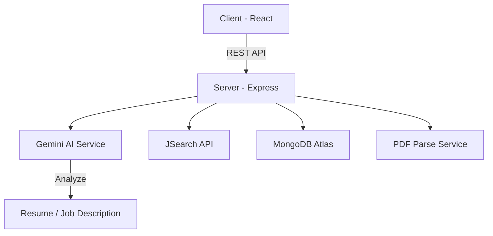

# 🚀 AI Job Application Tracker

<div align="center">


[](https://opensource.org/licenses/MIT)
[](https://reactjs.org/)
[](https://nodejs.org/)
[](https://www.mongodb.com/)
[](https://tailwindcss.com/)
[](https://aistudio.google.com/)

**The intelligent way to manage your career journey. Powered by Google Gemini AI.**

[Features](#-features) • [Tech Stack](#-tech-stack) • [Architecture](#-architecture) • [Getting Started](#-getting-started) • [API](#-api-endpoints)

</div>

---

## 🌟 Overview

**AI Job Tracker** is a professional-grade, full-stack application designed to streamline the modern job search. By leveraging **Google Gemini AI**, it automates the tedious parts of tracking applications, analyzing job descriptions, and extracting insights from resumes.

Gone are the days of messy spreadsheets. Welcome to a centralized, AI-enhanced command center for your career growth.

---

## ✨ Features

### 📄 Intelligent Resume Parsing
*   **Automated Extraction**: Upload your PDF resume; Gemini extracts skills, experience, and target roles.
*   **Search Optimization**: Generates optimized search queries based on your professional profile.
*   **Live Feedback**: Real-time analysis with visual feedback during the upload process.

### 🔍 Cross-Platform AI Search
*   **Unified Results**: Aggregate job postings from **LinkedIn, Indeed, and Glassdoor** via the JSearch API.
*   **Smart Filtering**: Advanced filters for location, remote status, and employment type.
*   **One-Click Tracking**: Instantly save jobs from search results to your personal dashboard.

### 📊 Professional Dashboard
*   **Visual Analytics**: Track your progress with animated status cards (Applied, Interviews, Offers, Rejections).
*   **Instant Filtering**: Click any metric to filter your job list immediately.
*   **Search & Sort**: Find specific applications by company or title with ultra-fast client-side filtering.

### 🤖 Deep Job Analysis
*   **Skill Gap Analysis**: Extract required skills from any job description and compare them to your profile.
*   **Risk Detection**: Automatically identify "Red Flags" like unpaid trials or toxic language.
*   **Responsibility Breakdown**: Summarizes complex job descriptions into actionable bullet points.

---

## 🛠️ Tech Stack

### Frontend
- **Framework**: React 18 with Vite for lightning-fast builds.
- **Styling**: Tailwind CSS for a responsive, modern UI.
- **State Management**: Zustand (lightweight and performant).
- **Animations**: Framer Motion for premium-feel transitions.
- **Icons**: Lucide React.

### Backend
- **Runtime**: Node.js 18+.
- **Framework**: Express.js with a clean service-oriented architecture.
- **Database**: MongoDB with Mongoose for structured data modeling.
- **AI Engine**: Google Generative AI (Gemini 1.5 Pro/Flash).
- **Security**: Helmet, CORS, and Express Rate Limit.
- **Validation**: Zod for robust environment and request schema validation.

---

## 🏗️ Architecture

The project follows a modular, scalable architecture designed for reliability and maintainability.



### Key Highlights:
- **Resilient AI Calls**: Implements exponential backoff and 30s timeouts for Gemini API calls.
- **Layered Design**: Clear separation between Routes, Controllers, Services, and Models.
- **Security First**: Production-ready middleware for rate limiting and header security.

---

## 🚀 Getting Started

### Prerequisites
- Node.js ≥ 18.0.0
- MongoDB (Local or Atlas)
- [Google Gemini API Key](https://aistudio.google.com/apikey)
- [RapidAPI Key (JSearch)](https://rapidapi.com/letscrape-6bRBa3QguO5/api/jsearch)

### Installation

1.  **Clone the Repo**
    ```bash
    git clone https://github.com/Dhpatel001/ai-job-tracker.git
    cd ai-job-tracker
    ```

2.  **Server Setup**
    ```bash
    cd server
    npm install
    # Create .env with MONGO_URI, GEMINI_API_KEY, RAPIDAPI_KEY
    npm run dev
    ```

3.  **Client Setup**
    ```bash
    cd ../client
    npm install
    npm run dev
    ```

---

## 🔌 API Endpoints

| Method | Endpoint | Purpose |
| :--- | :--- | :--- |
| `POST` | `/api/resume/upload` | Upload PDF and extract skills via AI |
| `POST` | `/api/analyze` | Deep-dive analysis of a job description |
| `GET` | `/api/jobs` | Retrieve all tracked applications |
| `POST` | `/api/jobs` | Manually add a new job application |
| `GET` | `/api/jobs/stats` | Get application metrics for dashboard |

---

## 📄 License

Distributed under the MIT License. See `LICENSE` for more information.

---

<p align="center">
  Built with ❤️ for the Developer Community
</p>
